# モデリング

この章では，モデリングについて学びます．モデリングというのは，集められたデータをもとにデータの背後にある一般的な特徴を見出すために，データを用いて数式や数理的記述で表現することです．数多くのモデリングが存在しますが，ここでは基本的，かつ，代表的なモデリングについて説明します．モデリングを学ぶことにより，世の中におけるデータを用いた予測・分類などの利用方法が分かると思います．

## モデリング

世の中では，得られたデータをもとに色々な予測・分類が行われています．例えば，

- 過去の気象データをもとに明日の天気を予測
-  過去の天気と弁当売上データをもとに明日の天気から弁当の売上を予測
- 過去の広告費と売上データをもとに，かける広告費による売上を予測
- 食物栄養素データからダイエットに適してる食品かそうでないかの分類
-  都道府県における食品の購入データから県民性の分類

などありますが，その他にも世の中でデータを利用した予測・分類が数多く行われているのはご存知でしょう．これらの予測・分類は，実際に集められたデータをもとにデータの背後にある一般的な特徴を見出しています．その特徴を表現するために，データを数式や数理的記述で表現することを**モデリング（統計的モデリング）**といいます．  モデリングには数多くの手法が存在します．


近年，大量のデータ（ビッグデータ）を用いコンピュータに学習させ予測させる機械学習が注目されています．機械学習でもモデリング手法は利用され，学習の仕方によりモデリングは教師あり学習と教師なし学習に分類されます．教師あり学習と教師なし学習の違いは次のとおりです．


- **教師あり学習**：既に得られている入力データとその中で正解であることを示す正解ラベルのセットをコンピュータに与えることにより，入力データと正解ラベルをもとににコンピュータがそれらの特徴を学習していき，予測のための未知データが入力されたら正解か否か判断できるようなります．
  
  教師あり学習と呼ばれるのは，既知データから学習する過程が先生が生徒に学習を指導しているように見えるからです．既知データと正解が用意されており，モデリング手法はそれを利用して予測を行い，正解，不正解によりその予測結果の修正が繰り返され学習することになります．

- **教師なし学習**：既知の入力データのみが与えられ，ペアとなる正解のデータは存在しません．入力データに対する類似度や規則性を用いて，分類や頻出パターンを見つけ出す学習方法です．
  
    教師なし学習と呼ばれるのは，教師あり学習と違ってそこには正解データがない，つまり先生がいないためです．

よく利用されるモデリング手法を「教師あり学習」と「教師なし学習」で分類したものを以下に示します．

|          | 手法             |
| -------- | ---------------- |
| 教師あり | 回帰分析<br>k近傍法<br>サポートベクターマシン<br>ロジステック分析        |
| 教師なし |  クラスタリング<br>主成分分析             |

それ以外にも色々な手法は存在しますが，以下では教師あり学習として代表的な回帰分析と教師なし学習として代表的なクラスター分析について説明します．


##  回帰分析

ここでは，教師あり学習の分析方法のひとつである回帰分析について説明します．後ほど定義しますが，回帰分析には単回帰分析，重回帰分析などあります．両手法とも基本的な考えは同じなので単回帰を学べば重回帰は理解できますので，単回帰について説明することにします．回帰分析を説明する前に，まずは前章で学んだ相関関係と因果関係について考えます．

### 相関関係と因果関係

相関関係とは，一方が増加するとき他方が増加，または，一方が減少するとき他方が減少という傾向が認められるという2つの変量の関係です．前章で学んだ相関係数とは，２つの変量の関係がどれくらい直線に近いかを調べる指標になります．例えば，相関関係として以下の例が考えられます．

- 身長と体重の関係
- 為替レートと株価の関係
- 模擬試験と本試験の関係
- 喫煙率と病気の関係

一方，因果関係とは，一方の変数が原因となり他方の変数が結果として変動することです．上記の４つの例は因果関係もあると考えられていますが，以下の例はどうでしょうか？

- アイスクリームの売上とエアコン売上の関係

これは，暑くなると共に増加するので相関関係になります．しかし，この両方の事象の共通の原因は夏の気温であり，アイスクリームが売れたからエアコンが売上が増えたわけではないので 因果関係は無い事例になります．

注意すべき点としては，因果関係は相関関係ですが，相関関係の中でも原因と結果を表しているものだけが因果関係となることです．つまり，因果関係のあるものには相関関係がありますが，相関関係は必ずしも因果関係とはなりません．

ここで取り扱う回帰分析とは，因果関係が考えられる現象に対し，その原因をもとに結果を予測するモデルとなります．


## 単回帰分析

例として自動車の速度と制動距離の関係についての考え，2つの関係を数式で表しモデリングを行います．速度と制動距離に関しては，因果関係がありそうだというのは想像できるかと思います．実際にどんな関係にあるのか調べてみます．

まずは説明しやすいように，少ないデータで説明します．与えられるデータは，次の５つとします．（後で，データ数が50の場合についてコンピュータを使って求めます．）ただし，後ほど利用するR言語で準備されているデータセットを利用しているので，速度の単位はmph（マイル毎時）となり，制動距離の単位はft（フィート）となります．


|速度	|制動距離 |
| -------- | ---------------- |
|7|4|
|10|18|
|12|14|
|14|26|
|17|32|


このデータの散布図が図○　となり，相関関係があるのが分かると思います．また，速度が上がれば制動距離が伸びるので，原因と結果に関係にあるので因果関係もあります．このサンプルデータをもとにモデルを作成します．次に，回帰分析で必要となる変数について説明します．

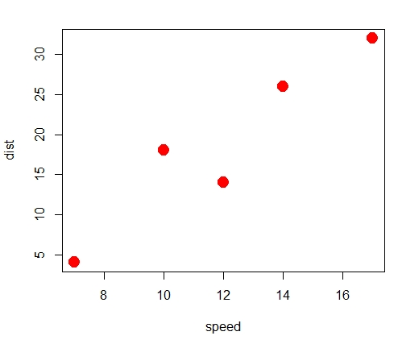


### 変数

回帰分析では，既知のデータを用い数式で表現するモデルを作成し，そのモデルに未知のデータを入力することにより予測を行います．数式モデルを作成するにあたりまず考えることは，何を入力データとし，結果として何を予測したいかということを明確にすることです．つまり，数式モデルにおいて変数を明確にする必要があります．数式モデル作成においては，変数は目的変数と説明変数に分けられます．


- **目的変数**（**従属変数**とも呼ばれます）：数式モデルを利用して求める予測の対象となる変数のこと
- **説明変数**（**独立変数**とも呼ばれます）：目的変数を求めるにあたり原因となる変数のこと


ここでは，目的変数と説明変数との関係性を次節で説明する回帰モデルという方程式によって表します．特に，説明変数が１つの回帰モデルを**単回帰モデル**と呼び，説明変数が２つ以上の回帰モデルを**重回帰モデル**と呼びます．ここで取り扱う例である速度と制動距離では，目的変数が制動距離となり，説明変数が速度となります．説明変数が速度のひとつですので，単回帰モデルとなります．


### 単回帰直線の求め方

相関分析は，データ間の関係性の強さを調べるものでした．2つの変量がどのくらい強い関係であるかについて相関係数を求めることで判断することができました．更にもう一歩進め，一方が増えるともう一方はどれだけ増えるか，またはどれだけ減るか，を予測するのがこの節の内容になります．散布図にプロットされた点を1本の線で代表することを**回帰**と呼び，特に1本の直線で代表することを**直線回帰**，その直線のことを**回帰直線**と呼びます．回帰直線が求まれば，説明変数のデータがなくても目的変数の値を予測できるようになります．例えば，車の速度と制動距離の場合，速度データがなくても制動距離の予測ができるようになるということです．

一般的な回帰直線は，

$$
f = a + b_1 x_1 + b_1 x_1 + \cdots + b_k x_k
$$
と線形方程式で表現され，$f$ が**目的変数**，$x_1, x_2, \cdots, x_k$ が**説明変数**，$a$を**切変**，$b_1, b_2, \cdots, b_k$ を**回帰係数**といいます．切片$a$，回帰係数$b_1, b_2, \cdots, b_k$を**パラメータ**といい，与えられたデータからパラメータを求める作業になります．パラメータが分かれば，説明変数の変化と目的変数の変化の関係が分かり，説明変数から目的変数を予測することができるようになるということです．説明変数が１つの場合，**単回帰**といい，２つ以上の場合，**重回帰**といいます．ここでは，単回帰について説明します．


サンプルデータより一次式である単回帰方程式を求めるのが単回帰直線分析におけるモデリングになります．単回帰方程式は，次のように表せます．
$$
f=a+bx
$$
$f$が目的変数$y$の予測値であり，$x$が説明変数となります．$a$が切変であり$b$が回帰係数になります．サンプルデータより，適切だと考えられる予測値$f$を求めるためのパラメータである$a$と$b$を求めることになります．

一次式は無限に存在するので，どの一次式が予測するためのモデルである単回帰方程式として一番適しているかを考えなければなりません．そこで単回帰方程式は，サンプルデータを用い最小二乗法という手法を用いて求めています．最小二乗法について説明します．


### 最小二乗法

図○にあるように，散布図に直線（一次式）はいくつでも引くことができます．一本の直線を想定すると，データの各点から直線への垂直方向へのずれが生じているのがわかります．サンプルデータと予測値を結ぶ両方向矢印の長さを**残差**といいます．各データの残差をそれぞれ2乗してすべて足すと，想定される直線とすべてのデータとのずれ具合を表す量となります．つまり，最小二乗法は，実測値と理論値の残差が小さくなるようにパラメータを決定する方法です．

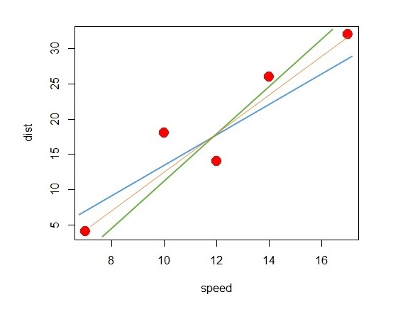


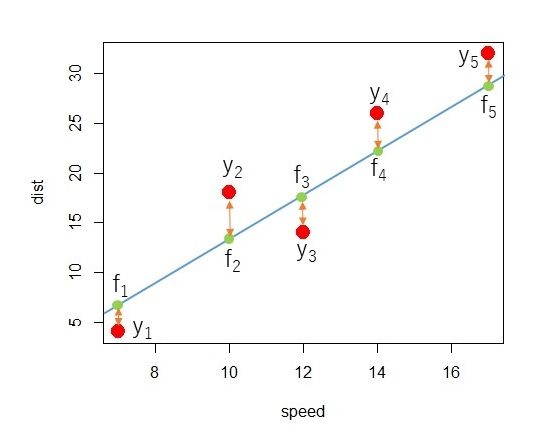

最小二乗法について，定式的に記述すると次のようになります．サンプルデータ数を$n$とすると，

目的変数：$y_1, y_2, \cdots, y_n$
説明変数：$x_1, x_2, \cdots, x_n$
理論値：$f_1, f_2, \cdots, f_n$

となります．単回帰方程式でモデル化するということは，一次式
$$
f_i=a+bx_i
$$
を求めることになります．$f_i$はモデル化により求まる理論値であり，実測値は$y_i$なので，残差は$f_i-y_i$となります．$n$個のサンプルデータ全てに対し，この残差$f_i-y_i$の2乗してすべて足した値$S$を**残差平方和**と呼びます．残差平方和$S$は，
$$
S=\sum^n_{i=1}(f_i-y_i)^2
=\sum^n_{i=1}(a+bx_i-y_i)^2
$$
となります．$n$個の$x_i$, $y_i$を代入し，$S$が最小となるようなパラメーター$a$と$b$が求まればモデル化ができたことになります．$S$は$a$と$b$の二つの変数を持つ2次関数であるので，$S$が最小となるようなパラメーター$a$と$b$を求めるには，$S$を$a$または$b$で偏微分することで求まります．ただし，現時点で偏微分は学んでいないので，偏微分を使いどのように$S$が最小となるようなパラメーター$a$と$b$を求め方については省略します．後ほど，R言語やPythonを用いて回帰直線を求めますが，R言語やPythonにはパラメーター$a$と$b$を求める機能が備わっています．


### 単回帰方程式の精度

相関係数が１または -１に近いときは，データが直線上に存在し，０に近いほどデータが散らばっています．単回帰方程式は，与えられたデータをもとに代表となるひとつの一次式を求めています．その一次式がデータの代表としてうまく表現されているか否かの評価をする必要があります．例えば，図○(a)のような場合，単回帰方程式はデータの散らばりを上手く表現しているので，この一次式を用いて説明変数$x$から$f$を用いて$y$を予測できそうです．一方，図○(b)の場合，データが散らばりすぎて，求めた一次式を用いて$y$を予測するのは困難です．よって，予測に使えそうか否かを判断するために，単回帰方程式の精度を表す指標が必要となります．その指標を決定指数といい$R^2$で表されます．決定指数について説明します．


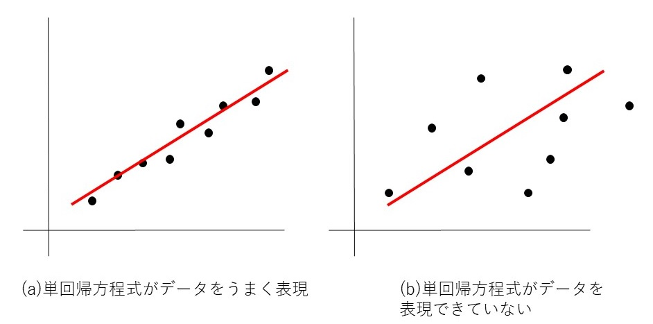


目的変数$y_1, y_2, \cdots, y_n$の平均値は，
$$
\overline{y}=\frac{(y_1+y_2+\cdots+y_n)}{n}
$$
です．各目的変数の値から平均との差の二乗和を**偏差平方和**といい$\hat{S}$で表します．
$$
\widehat{S}=(y_1-\overline{y})^2+(y_2-\overline{y})^2+\cdots+(y_n-\overline{y})^2
$$
先に説明した残差平方和$S$は，
$$
S=(y_1-f_1)^2+(y_2-f_2)^2+ \cdots +(y_n-f_n)^2
$$
となります．決定変数は，偏差平方和と残差平方和を用いて，
$$
R^2 = 1- \frac{S}{\widehat{S}}
$$
となります．この式は，残差の２乗和を実測値の分散で割っているので，残差と実測値の変動を比較することができます．$R^2$は，0から1の値を取り，残差が小さくなれば１に近づきます．つまり，$R^2$が１に近ければ単回帰方程式のモデルはデータに適合していることを意味し，０に近ければモデルはデータに適合していないことを意味しています．この値を一つの指標としてモデルが利用できるか否かの判断に利用できます．

次節で説明しますが，決定係数はR言語やPythonなどのツールで簡単に計算することができます．本節で用いた表○のデータに対する$R^2$は，0.895 であり1に近いのでモデルに適合していると言えるでしょう．


### R言語による単回帰分析

ここでは，R言語を用いて単回帰分析のやり方について説明します．使用するデータは，R言語で用意されている車の速度と制動距離に関するデータを使用します．前節における表○のデータは，このデータから５つのデータを一部抜き出したもので，もともとは５０個のデータからなります．

まずはデータを確認しましょう．R言語でのデータセットの名称は，"cars" ですので，次のように入力すれば，データの一覧が出力されます．

```
>cars　# データ表示
```

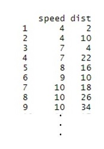

このデータは2変量で，一列目の番号がインデックス，二列目の speed が速度[mph]で，三列目の dist が制動距離[ft]を表しています．次に，説明変数である速度を$x$軸に目的変数である制動距離を$y$軸とした散布図を描きます．R言語では，関数plot(データフレーム名) を利用して，第一引数にデータフレーム名を記述すれば簡単に描くことができます．

```
>plot(cars)　# 散布図を描画
```

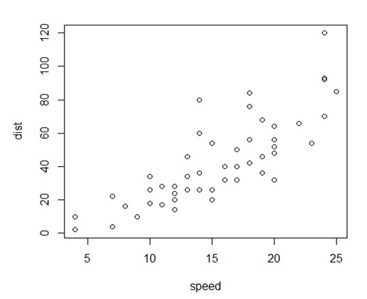

散布図におけるデータを見るかぎり相関がありそうですが，本当に相関があるのかを確認します．相関係数は，cor関数で求めることができます．関数cor() は，二つの変数のデータセットを$x$, $y$とすると，　cor(x,y) で求めることができます．ここでは，cars$speed にデータフレームcarsにおける速度に関するデータが入っており，cars$dist には制動距離のデータが入っていますので，次のように実行します．

```
>cor(cars$speed, cars$dist)　# 相関係数を計算
```

データフレームcarsの相関係数は 0.8068949 であり，正の相関があることが分かりますので，単回帰分析を行います．R言語では回帰分析を行うlm関数が存在します．関数lm( )は，

​                    *lm(Y~X, data=データ名)*

と第一引数に目的変数Yと説明変数X，第二引数にデータ名を記述します．ここでは，目的変数が dist で説明変数が speed，データセット名が cars なので次のように入力し，解析結果を変数resultに代入します．また，単回帰方程式を散布図上に描画するために，abline関数を利用します．関数abline(変数)により，単回帰分析を行った結果が入った変数を描くことができます．関数 abline() の引数 col を使い abline(変数, col="red") と入力すれば，線の色を変えることができます．ここでは，単回帰方程式を赤色で描いています．

```
>result <- lm(dist ~ speed, data=cars)　# 単回帰分析を実行
>abline(result, col="red")　# 単回帰曲線の表示
```

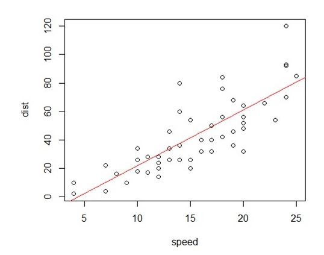

求めた単回帰方程式の切変，回帰係数の値，および，先ほど「単回帰方程式の精度」の節で説明した決定係数$R^2$の値wを見るには，summary関数を利用します．関数summary(変数)により，結果の値を見ることができます．

```
>summary(result)　# 決定係数などを表示
```


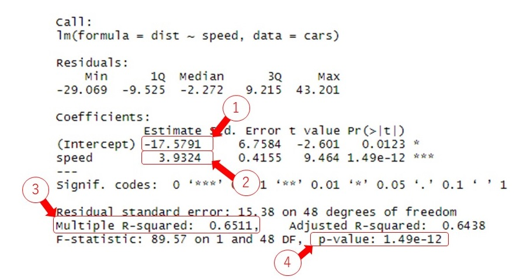


色々な値が出力されますが，結果の見方について説明します．以下の番号は図○の番号に対応します．

1. Estimate における (Intercept) の右側の値が切片になります．

2. Estimate における説明変数である speed の右側の値が単回帰係数となります．

以上より，先ほど散布図と一緒に描かれたデータセット cars の単回帰方程式は，

$$
f = -17.5791 + 3.9324 \times x
$$
となります．

3. Multiple R-squared とは，前節で説明した決定係数のことです．決定係数とは，目的変数の分散のうち，説明変数で説明できた割合を表現しており，モデル（単回帰方程式）のデータへの適合度の指標となります．この値が１に近いほど説明変数で目的変数を予測できることになります．この値が０に近いという事は，説明変数が目的変数に寄与していないということなので，モデルとして予測に利用できないことになります．

   ここでは，Multiple R-squared:  0.6511ですので，65% の適合度ということになります．決定係数はいくつ以上あれば良いという統計学的基準はありません．この基準は，分析者が経験的な判断から決めることになりますが，以下のようなひとつの目安は存在します．$R^2 \geq 0.8$であれば，単回帰方程式はモデルとして精度良く予測に利用できると考えられています．$R^2 \geq 0.5$であれば，精度やや良く予測に利用できると考えられています．ただし，$R^2 < 0.5$となると，モデルとして利用するには厳しいと考えられています．
   

   
4. F-statistic の部分では，単回帰係数が０という帰無仮説に関するF検定の結果です．右側に p-value というのがありますが，これは単回帰係数の値が0であると可能性を検討した値となります．この値は確率の値であり，0.05(5%)以下であれば，単回帰係数が0であるという帰無仮説は棄却されます．つまり，単回帰係数は0でないので，説明変数は目的変数の予測に利用できることを示しています．

   ここでの結果では，p-value: 1.49e-12 と記述されていますが，これは$1.49 \times 10^{-12}$ を意味しており，ほぼ０です．よって，説明変数である速度は目的変数である制動距離の予測に利用できることが言えます．


### R言語でデータをファイルから読み込む場合

前節ではR言語に準備されているデータセットを利用しましたが，自分でデータを用意した場合，どのようにファイルを読み込むかについて説明します．ここでは，先ほどのデータセット cars がcsvファイル形式でファイル名 " cars.csv " として準備されているとします．エクセル表示すると次の図のようになります．


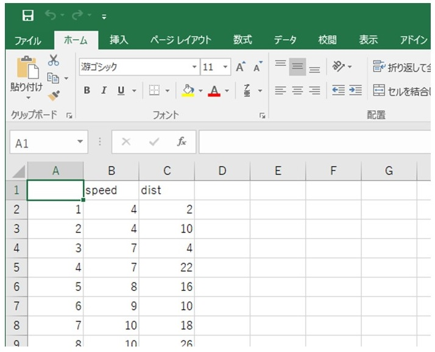


まずは，読み込むためのファイル cars.csv を置く場所を確認しましょう．ファイルを置いている場所の指定方法は色々ありますが，ここでは作業フォルダを設定し，そこにファイルを置いて読み込む方法について説明します．まず，関数setwd で現在の作業ディレクトリを確認することができます．作業フォルダに読み込むファイルを置いている場合には，これで問題ありません．もし違う場所に置いている場合には，ファイルが置かれている場所を作業ディレクトリに指定する必要があります．（または，現在の作業ディレクトリに読み込むファイルを移動される方法でも構いません．）作業ディレクトリを変更するには，関数setwd を使い，以下のように実行することで作業ディレクトリを変更できます．


```
>getwd()                     # 現在の作業ディレクトリを確認
>setwd("/Users/username/Documents")  # 作業ディレクトリの変更
　　　　　　　　　　　　　　　　　　　　　　#"/Users/username/Documents" は架空ですので，自分のコンピュータにおける作業ディレクトリを設定すること
>getwd()                     # 変更後の作業ディレクトリを確認
```


A列には１から順番にインデックスが入ってます．また，一列目にはヘッダーである speed，dist の文字列が入っています．R言語では，csvファイルを読み込むには，read.csv関数が準備されています．関数 read.csv() は，引数を設定することによりデータの読み込み方が変わります．

​                              *read.csv( "ファイル名", header=T, row.name=1)*

第一引数として，読み込みたいデータのファイル名をダブルクォーテーション”　”で囲みます．

引数 header を指定することにより，第一列にヘッダー文字列があるか無いかを指定することができます．一列目にヘッダーあるときはT（TURE），ない時はF（FALSE）を header に設定します．今回扱うデータ cars の場合，第一列にヘッダーが付いているので，header=Tで読み込む必要があります．デフォルトでheaderはTRUEであるので指定しなくても大丈夫ですが，ここでは一応指定しています．ヘッダーが無く，一行目からデータ値が入っている場合は，header=F と設定することになります．

引数 row.names は1列目（エクセルならA列）にインデックスが存在するかしないかを設定します．row.names=1 と設定すると，1列目がインデックスとみなします．今回のデータの場合，１列目にインデックスが入ってますので，row.names=1 と指定する必要があります．インデックスが無く，1列目からデータ値が入っている場合には，設定する必要はありません．

以上より，次のようにしてファイルを読み込む，変数 cars_data にデータを格納することができます．


```
>cars_data <- read.csv(“cars.csv”,header=T,row.names=1)　# csvファイルからデータの読み込み
>cars_data 　　# 格納されたデータの表示
```


あとの処理は，前節と同じで cars を cars_data に変更すれば同じ結果となります．


### Pythonによる単回帰分析

Python による単回帰分析について説明します．使用するデータは，R言語同様にデータ "cars" を使用します．データ "cars" が記述されている csv ファイル cars.csv をまず読み込む必要があります．また，必要なライブラリを読み込んでおきます．csv ファイルを読み込むには関数pd.read_csv() を用います．csv ファイル ruspini の内容は，1行目にヘッダー（見出し行）が存在し，文字 speed，dist が入っています．また，インデックス（見出し列）として，1列目には連続する番号が存在します．関数pd.read_csv() では，引数になにも指定しなければ1行目をヘッダーとみなし，引数として index_col=0 とすることにより一列目をインデックスとして読み込まれます．よって，以下の命令で csvファイルよりデータを読み込むことができます．

```
# ライブラリの読み込み
import numpy as np
import pandas as pd 
import matplotlib.pyplot as plt 
from sklearn.linear_model import LinearRegression 

# csvファイルよりデータ読み込み
df = pd.read_csv('/users/username/documents/cars.csv', index_col=0) 
　　　　　#'/users/username/documents/ruspini.csv' は架空ですので，自分のコンピュータにおけるファイルを置いているパスを設定すること
```


ここでは，ヘッダーとインデックスは取り除いたデータのみ必要となるので，次の命令でヘッダー，インデックスを取り除き，変数 x ヘッダー speed の列の値を代入し，変数 y にヘッダー dist の列の値を代入します．確認のために，データ cars における散布図を描画します．Pythonでは，plt.scatter(x,y) で引数に x 軸 y 軸の値が入った変数を設定し，plt.show() を実行すれば簡単に散布図を描くことができます．


```
x = df.speed　# x軸の値を代入
y = df.dist   # y軸の値を代入

plt.scatter(x,y,c="black") # 描画設定
plt.show()　# 描画実行
```


回帰分析を行う関数 LinearRegression() を利用しますが，実行する場合に2次元配列で渡す必要がありますので，x，y のデータを2次元配列に変更します．そのあと単回帰分析を実行します．

```
x = df[['speed']] #　説明変数に値を代入
y = df[['dist']]  #　目的変数に値を代入

model = LinearRegression() # 回帰分析設定
model.fit(x, y)　# x,yをもとに回帰分析実行
```


求めた単回帰方程式を散布図の上に描画します．描画する関数 plt.plot() を用いますが，最初の plt.plot() では，第一引数に x座標の値，第二引数に y座標の値，第三座標にプロットする文字を指定しています．2つ目のplt.plot() では，第一引数に x座標の値，第二引数に求めた単回帰方程式における y座標の値とし，第三引数でlinestyle="solid" と指定することにより直線を描いてます．また，第四引数 color="red" として線の色を赤色に指定してます．


```
plt.plot(x, y, 'o') 　# 散布図描画設定
plt.plot(x, model.predict(x), linestyle="solid", color="red") # 単回帰直線描画設定
plt.show()　# 描画実行
```


最後に，単回帰方程式の回帰変数，切片，および，評価として決定係数　$R^2$を出力します．

```
# 単回帰変数，切片，単回帰方程式，および，決定変数の表示
print('単回帰方程式の単回帰変数 w1: %.3f' %model.coef_) 
print('単回帰方程式の切片 w2: %.3f'%model.intercept_) 
print('y= %.3fx + %.3f' % (model.coef_ , model.intercept_)) 
print('決定係数 R\^2： ', model.score(x, y))
```


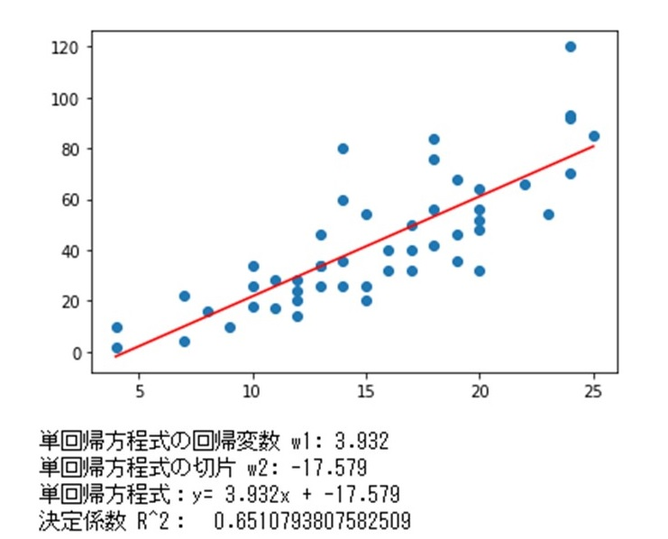


## クラスター分析

近年，ビッグデータのような巨大データを手に入れることができるようになってきました．しかし，データ数が膨大なため，人の手によって巨大データに含まれる特徴，傾向を見出すことは困難です．そこで，データ全体からデータの類似度などを計算してグループに分類する方法としてクラスター分析が存在します．本章では，クラスター分析について説明します．

**クラスター**とは，「房」，「集団」，「群れ」という意味です．最近，新型コロナ報道でクラスターという言葉をよく耳にしますが，感染が発生している集団という意味で使われています．ここでのクラスターとは，図○のように，データ全体の中から性質の似たグループのことをいいます．分類されたクラスターを第一クラスター，第二クラスターといいます．


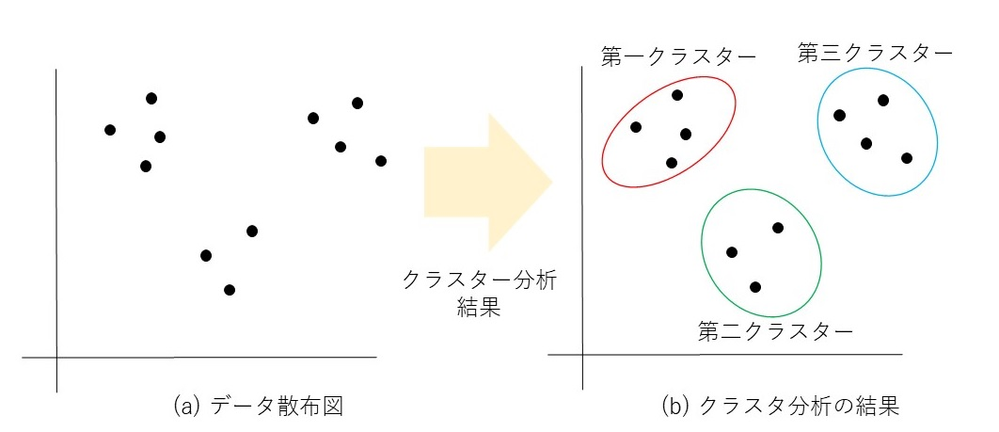


クラスター分析は，色々な場所で利用されている分析手法です．我々の身近なところでは，ネット通販やコンビニなどで商品を購入時に購入者の性別や年齢などの情報を蓄積することにより，購入者の性別・年齢などによる消費傾向をグループに分類しています．このような分類を行うことにより，売れ筋商品開発，おすすめ商品の提案などに利用できます．

### 階層的クラスターと非階層的クラスター

クラスター分析には，階層的クラスターと非階層的クラスターの２つがあります．**階層的クラスター**は，段階的に分類を行います．まず第一段階で個々のサンプルをひとつのクラスターと考え，それを近いものから併合してクラスターを大きくし第二段階のクラスターを構成します．第三段階では，第二段階のクラスターをもとに近いクラスターを併合します．この処理を繰り返すことにより，最終的にデータ全体を複数のクラスターに分けることになります．

 一方，**非階層的クラスター**では，分析者が予め作成するクラスター数を指示します．その数を目標にしてデータの中から特定の割合でランダムに選ばれたデータをクラスターの初期値とします．今度は先の分析に使われなかったデータを様々な形で既存のクラスターに併合をおこないデータ全体をクラスターに分けます．

以下では，階層的クラスターと非階層クラスターの代表的な手法について述べますが，その前にクラスターでは距離というのが重要になりますので，それについて説明します．


### 距離

クラスタリングでは，データ間の類似度を測るのに距離を用います．ただし，距離の測定の仕方も色々な手法があり特徴が異なります．私たちに一番馴染みがあるのは，2次元平面上で二つのデータ $d_1 = (x_1, y_1)$，$d_2 = (x_2, y_2)$ が与えられたとき，ユークリッド距離 $d(d_1, d_2)$は，
$$
d(d_1, d_2) = \sqrt{(x_1 - x_2)^2 + (y_1 - y_2)^2}
$$
となります．ユークリッド距離以外にも，マンハッタン距離，マハラノビス距離など異なる距離の計算方法はありますが，ここでは距離を測るのにユークリッド距離を用いることにします．これは値が小さいほど類似度が高いことを示すので**非類似度**と呼ばれます．

クラスター間の距離の定義の仕方にはも種々の方法があります．ここでは，クラスター間で利用される色々な距離測定方法について説明します．以下では，データ $x_1$，$x_2$ の距離(非類似度)を $d(x_1, x_2)$ で表し，クラスター $C_1$，$C_2$ の距離を $d(C_1,C_2)$ で表します．

- **最短距離法**

クラスター$C_1$ に含まれるデータ $x_1$ とクラスター $C_2$ に含まれるデータ $x_2$ のすべての組み合わせにおいて，最小のデータ間距離をクラスター間の距離とします．


$$
d(C_1,C_2) = \min_{x_1 \in C_1, x_2 \in C_2} d(x_1, x_2)　となります．
$$


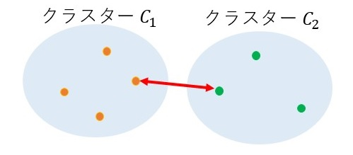


- **最長距離法**

クラスター$C_1$ に含まれるデータ $x_1$ とクラスター $C_2$ に含まれるデータ $x_2$ のすべての組み合わせにおいて，最大のデータ間距離をクラスター間の距離とします．
$$
d(C_1,C_2) = \max_{x_1 \in C_1, x_2 \in C_2} d(x_1, x_2)　となります．
$$


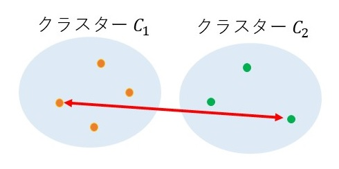


- **群平均法**

クラスター$C_1$ に含まれるデータ $x_1$ とクラスター $C_2$ に含まれるデータ $x_2$ のすべての組み合わせの距離求め，それらを平均した値をクラスター間の距離とします．
$$
d(C_1,C_2) = \frac{1}{ \mid C_1 \mid \mid C_2 \mid} \sum_{x_1 \in C_1}\sum_{x_2 \in C_2}d(x_1, x_2)　となります．
$$


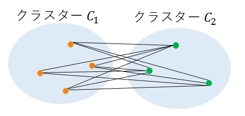


- **重心法**

クラスター$C_1$ と $C_2$ の重心を求め，重心間の距離をクラスター間の距離とします．
$$
クラスター C_i の重心\ \ \ g_i = \sum_{x \in C_i} \frac{x}{\mid C_i \mid} とすると．\\
d(C_1,C_2) = d( g_1, g_2 )　となります．
$$


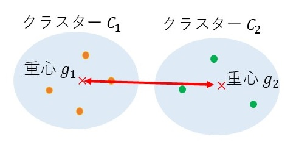


- **ウォード法**

2つのクラスター  $C_1$ と $C_2$ を結合したと仮定したとき,それにより移動したクラスターの重心とクラスター内の各データとの距離の2乗和と，元々の2つのクラスター内での重心とそれぞれのデータとの距離の2乗和の差をクラスター間の距離とします．
$$
クラスター C_i の重心 g_i = \sum_{x \in C_i} \frac{x}{\mid C_i \mid} とし，\\
クラスター C_i に含まれるデータと g_i の距離の2乗和 E( C_i ) は，\\
E( C_i ) = \sum_{x \in C_i} d( x, g_i ) ^2  とします．\\
d(C_1,C_2) = E( C_1 \cup C_2 ) - E( C_1 ) - E( C_2 )　となります．
$$


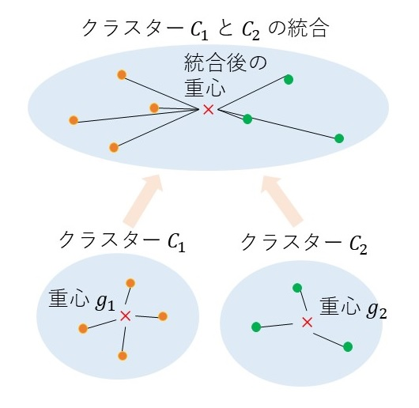


### 階層的クラスタリングの手順

階層クラスタリングでは，データ全体の中から似ている組み合わせを順番にまとめ分類を行います．基本的な手順としては，まず，各データを一つのクラスターとみなし，最も距離の近い二つのクラスタを逐次的に併合します．この距離の近いクラスター同士を併合するという処理を，全てのデータが一つのクラスタに併合されるまで繰り返すことで階層構造を作成します．この階層構造は図〇のような樹形図によって表示されます．**樹形図**とは，各終端ノードが各データを表し，併合されてできたクラスタを非終端ノードで表した二分木です．非終端ノードの横軸は，併合されたときのクラスタ間の距離を表します．最終的に，この出来上がった樹形図をもとに，データをクラスターに分割します．以下のサンプルデータを用いて，最短距離法を用いた手順について説明します．


No | x	| y 
:-- | :-: | --:
1| 1 |3 
2| 3 |1 
3|4	|8 
4| 5	|9 
5| 8	|5 
6| 10 |7 
 : サンプルデータ

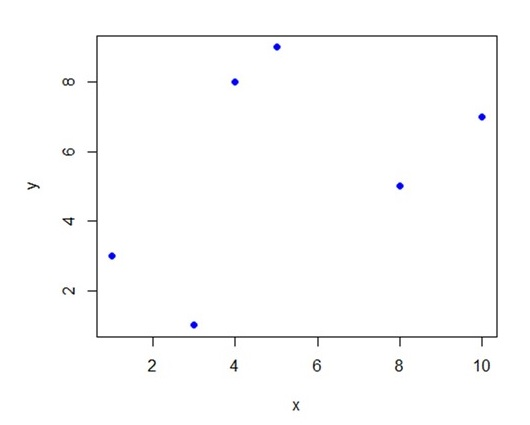

階層的クラスタリングは，次に示すStep１～３で実行されます．


**Step 1.**　一つのデータを一つのクラスターとします．つまり，$n$個のデータが存在したら，$n$個のクラスターを作成します．

**Step 2.**    全てのデータの組$(x_i, x_j)$, $i, j=1, \cdots, n$ に対し，距離 $d(x_1,x_2)$ を求め，その値からクラスター間の距離 $d(C_i,C_2)$  を計算し，最もこの距離の近い二つのクラスターを逐次的に併合します．

サンプルデータの場合，各データ間の距離は以下の表のとおりです．今回は最短距離法を用いていますから，表の中で距離が最小であるNO.3とNo.4の距離 $d(3,4)=1.41$ が選ばれます．その結果，NO.3とNo.4が併合されてクラスター１$C_1$となります．


No.  | 1 |	2 |  3 |	4 |  5
:-: |  :-: |  :-: |  :-: |  :-: |  :-: 
1	| | | | | 
2	|2.83 | | | |  		
3	|5.83 |	7.07 |	| | 
4	|7.21 |	8.25 | 	1.41 | | 
5	| 7.28 |	6.40 |	5.00 	| 5.00 |
6	| 9.85 | 	9.22 |	6.08 |	5.39 |	2.83  
 : データ間の距離


**Step 3.**   すべてのデータが1つのクラスターに併合されるまでStep 2を繰り返します．

サンプルデータの場合，クラスター$C_1$のデータNo.3, 4とクラスターに含まれていない各データの距離調べ，最短距離を選択します．

- データNo.1とクラスター$C_1$の場合

$C_1$のデータNO.3，No.4とNo.1の距離において，No.1のデータと近いのはNo.３です．よって，No.1と$C_1$の距離 は$d(1, C_1) = 5.83$ となります．

- データNo.2とクラスター$C_1$の場合

$C_1$のデータNO.3，No.4とNo.2において，No.2のデータと近いのはNo.３です．よって，No.2と$C_1$の距離は $d(2, C_1) = 7.07$ となります．

- データNo.5とクラスター$C_1$の場合

$C_1$のデータNO.3，No.4とNo.5において，No.5のデータとNo.３,4は同じ距離5です．よって，No.5と$C_1$の距離 $d(5, C_1) = 5.00$ となります．その結果をまとめると次の表のようになります．


No.|	 1| 		2| 		5| 		6 
:-: |  :-: |  :-: |  :-: |  :-: 
1	| | | | 
2 |	2.83 |  | 	|
5	| 7.28 	| 6.40  | |	
6	| 9.85 	| 9.22 	| 2.83  |
クラスター１	| 5.83 | 7.07 | 5.00 | 5.39 
: データ，クラスター間の距離


表\ref{距離２}より，最小な距離はデータNo.1，2とNo.５，6が同じ$d(1,2) = d(5, 6) = 2.83$です．よって，No.1，2 がクラスター2 $C_2$ となり，No.5，6 がクラスター3 $C_3$ となります．まだクラスターが一つに統合されていないので Step 2を続けます．クラスター１～３の各組合せにおける最短距離を求めると次のようになります．


|                        | クラスター１ | クラスター２ |
| ---------------------- | ------------ | ------------ |
| クラスター１（３，４） |              |              |
| クラスター２（１，２） | 5.83         |              |
| クラスター３（５，６） | 5.00         | 6.40         |
 : データ，クラスター間の距離


上の表より，最短距離は $d(C_1, C_3) = 5.00$ であるクラスター１とクラスター３なので，この二つのクラスターを統合します．再度繰り返し，クラスター２を統合すると全てのデータがひとつのクラスターに統合されたので終了となります．


**Step 4.**    樹形図をもとに、データをクラスターに分割します．

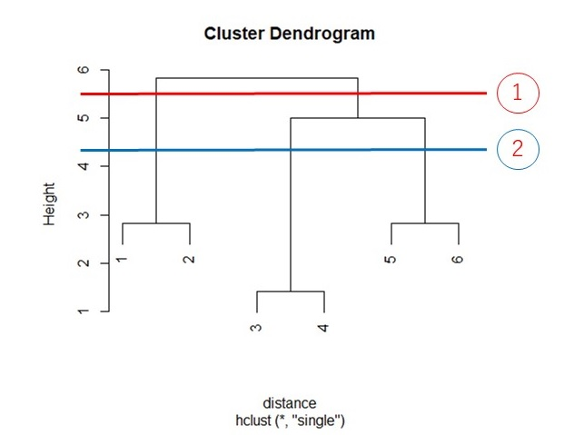


樹形図の左側の軸は距離を表します．クラスター１は$d(3,4)=1.41$ でしたが，左側の軸 1.4 あたりでNo.3 と No.4 が横棒で接続されているのが分かります．同様に，クラスター2，3 は，$d(1,2) = d(5, 6) = 2.83$ で横棒で接続されています．クラスター１とクラスター2，3 は，5.00 で接続されています．

いくつのグループに分類するかは分析者の判断によります．例えば，図\ref{樹形図}における1で切断するとクラスター2とクラスター1，3の二つのグループに分類できます．2で切断するとクラスター1，2，3 の三つのグループに分類されることになります．


### R言語による階層的クラスタリング

ここでは，R言語を用いて階層的クラスタリングのやり方について説明します．使用するデータは，R言語で用意されているクラスター分析用のデータ "ruspini" を使用します．まずはデータを確認します．R言語でのデータセットの名称は，"ruspini" であるので，次のように入力すればデータの一覧が出力されます．


```
>library(cluster)
>ruspini
```

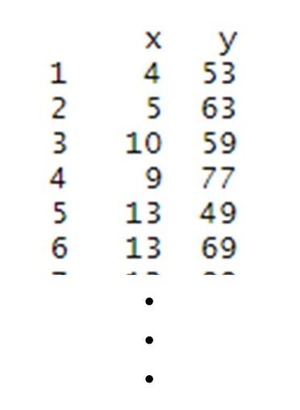


75個の $x$ 軸 $y$ 軸の値が与えられています．次に，どのようなデータか視覚的に確認するために plot関数を用い散布図を描きます．plot() の引数として　pch = 値 を用いています．これは点をプロットするときに用いるプロット文字を指定しています．pch=19 とすることによりプロットとして黒丸にしています．引数を指定しない場合にはプロットとして○となります．

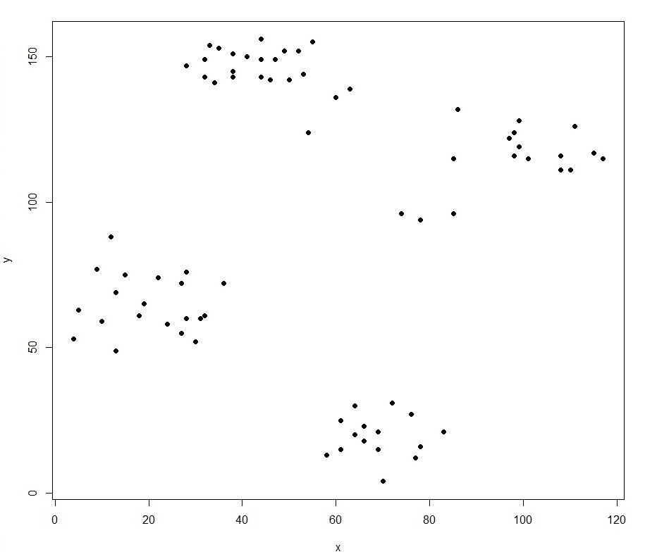


この散布図を見る限り，4つのクラスターに分類できそうですが，実際にどのようになるか確認してみましょう．まず，データフレーム ruspini の各データの非類似度を dist関数で求めることができます．ここでは，求めた非類似度を変数 ruspini-distance に代入します．先に述べたとおり，距離の測定方法には色々な方法があり関数 dist() では引数として各測定方法を設定することができます．ここではユークリッド距離を用いますが，引数を設定しない場合にはユークリッド距離を用いて距離が求められます．求めた非類似度を変数 ruspini-distance に代入するので，次のように dist( データセット名 ) と引数にデータセット名を記述します．


```
>ruspini-distance <- dist(ruspini) ＃非類似度を計算
```


階層的クラスタリングを行うには，関数 hclust を利用します．hclust は次のように記述します．

​                                         *hclust(非類似度を求めた変数, method = "クラスター間の距離測定方法" )*

引数 method で設定するクラスター間の距離測定方法を指定するには，次の表に記述した文字列を入力します．


測定方法　|  引数methodで設定する文字列 
 :-: | :-: 
最短距離法（単連結法）|	single 
最長距離法（完全連結法）|	complete 
群平均法 | average 
重心法 | centroid 
ウォード法（最小分散法）|	ward 
 : クラスター間の距離測定方法設定}


ここでは，最短距離法を使用し次の命令を実行します．

```
>ruspini_result <- hclust(ruspini_distance, method = "single")　# 階層的クラスタリングを実行
```


結果の樹形図を表示するため，次の命令を実行します．

```
>plot(ruspini_result)　# 階層的クラスタリングの結果を樹形図として描画
```


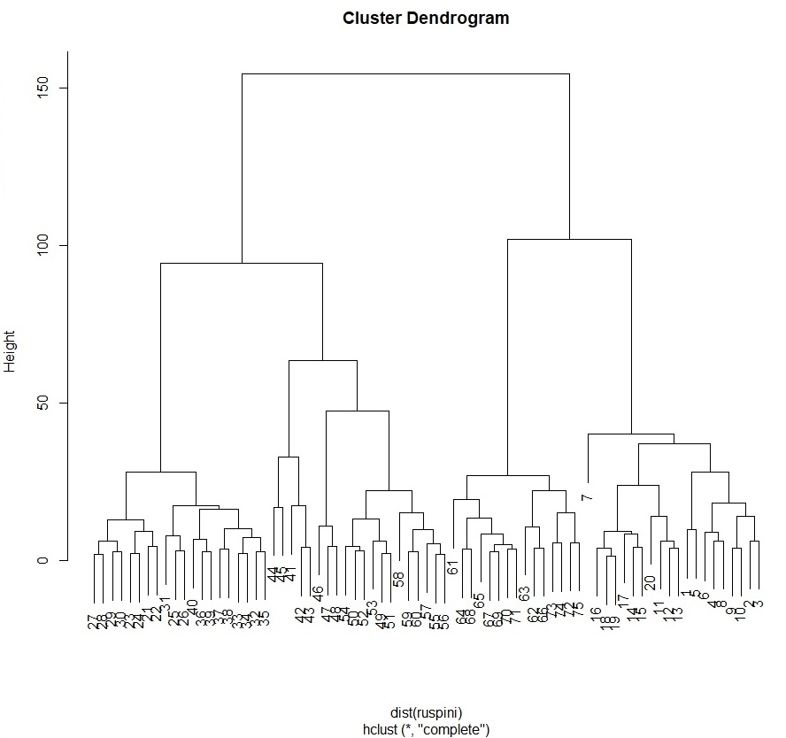


樹形図の一番下の部分にデータ番号が付いていますが，一瞥してどのように分類されたか視覚的には分かりにくいです．そこで，散布図上においてクラスターごとに各データを色分けして表示してみましょう．関数 cutree() を用いることにより，樹形図のデータをもとに指定する k 個のクラスターに分類してくれます．


```
>color4 = cutree(ruspini_result,k=4)   #色分けするため樹形図よりクラスターを4つに分類
>plot(ruspini, pch=20, asp=1, col=color4)　#クラスターを色分けした樹形図を表示
```


### Pythonによる階層的クラスタリング

Python による階層的クラスタリングについて説明します．使用するデータは，R言語同様にクラスター分析用のデータ "ruspini" を使用します．データ "ruspini" が記述されている csv ファイル ruspini.csv をまず読み込む必要があります．また，必要なライブラリを読み込んでおきます．csv ファイルを読み込むには関数pd.read_csv() を用います．csv ファイル ruspini の内容は，1行目にヘッダー（見出し行）が存在し，文字 x，y が入っています．また，インデックス（見出し列）として，1列目には連続する番号が入ってます．関数pd.read_csv() では，引数になにも指定しなければ1行目をヘッダーとみなし，引数として index_col=0 とすることにより一列目をインデックスとして読み込みます．以下の命令でファイルよりデータを読み込んでいます．


```
# ライブラリの読み込み
import matplotlib.pyplot as plt
import pandas as pd
import numpy as np
from scipy.cluster.hierarchy import linkage, dendrogram, fcluster

# csvファイルからデータの読み込み
df = pd.read_csv('/users/username/documents/ruspini.csv', index_col=0)
　　#'/users/username/documents/ruspini.csv' は架空ですので，自分のコンピュータにおけるファイルを置いているパスを設定すること
```


ここでは，ヘッダーとインデックスは取り除いたデータのみ必要となりますので，次の命令でヘッダー，インデックスを取り除いたデータのみ2次元配列として変数 Data に格納します．その後，散布図を描画するため変数 Data の一列目を xの値，2列目を yの値として取り出しています．関数 plt.scatter() で第一引数にx軸の値，第二引数に y 軸の値，引数 cal に色を設定し，関数 plt.show() でデータ ruspini における散布図を描画します．


```
＃読み込んだデータをｘ，ｙに代入
Data = df.values
x= Data[:,0]
y= Data[:,1]

plt.scatter(x,y,c="black") # 散布図のための設定
plt.show()　　# 描画の実行
```


階層的クラスタリングを行う関数 linkage() において，使用する距離の計算方法，クラスター間の距離測定方法など，いくつかの引数を設定します．

​                               *linkage( データ名, method=クラスター間の距離測定方法, metric=距離の定義)*

距離の定義については，ここではユークリッド距離を使用しますので，引数 metric に対し metric='euclidean' と設定します．クラスター間の距離測定方法は，ここでは最短距離法を用いますので，引数 method に対し，method='single' と設定します．（クラスター間の各距離測定方法の設定に用いられる引数 method の文字列は，上節のR言語の部分で示した表の文字列と同じです．）

```
linkage_result = linkage(Data, method='single', metric='euclidean') # 階層的クラスタリング実行
```


結果を樹形図で描画します．変数 threshold は，樹形図が求まったあと，縦軸の値のどこでカットするかによりクラスター数が変化します．変数 threshold により，樹形図においてクラスターごとに色分けされます．このデータの場合，threshold を20に設定すると4つのクラスターに分類され，30に設定すると3つのクラスターに分類されます．


```
threshold = 20 　# 縦軸でカットする値の設定

plt.figure(figsize=(16, 9))　#描画の設定
dendrogram(linkage_result, color_threshold=threshold)　# 樹形図の設定
plt.show()　　# 描画の実行
```


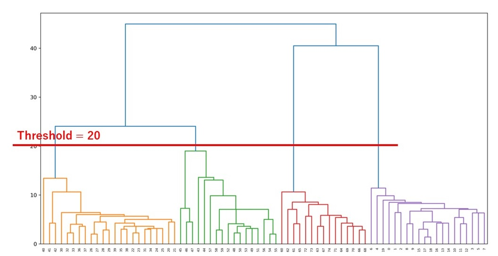


樹形図の一番下の部分にデータ番号が付いていますが，一瞥してどのように分類されたか視覚的には分かりにくいので，散布図上においてクラスターごとに色分けして表示します．

樹形図を基に縦軸のどの値でカットするかによりクラスター数が決まります．ここでは，縦軸20でカットすることにより4つのクラスターに分類しています．各データがどのクラスターに属するか調べるために，fcluster関数を利用します．関数 fcluster() は，距離を基準に threshold の位置をクラスタリング基準とし，クラスターに分類します．次の命令だと，threshold は20となっているので，樹形図の縦軸の値 20 を基準としてカットすることになります．変数 cluster には，各データのクラスター番号が格納されます．結果として得られたクラスター番号に基づき，例えば，クラスター番号が 1 の場合には赤色，0 の場合には青というように色分けを行っています．

```
cluster = fcluster(linkage_result, threshold, criterion='distance')
print(cluster)

plt.scatter(Data[cluster==1,0],Data[cluster==1,1],color="r") 
plt.scatter(Data[cluster==2,0],Data[cluster==2,1],color="b") 
plt.scatter(Data[cluster==3,0],Data[cluster==3,1],color="g") 
plt.scatter(Data[cluster==4,0],Data[cluster==4,1],color="orange") 
plt.show() 
```


### 非階層的クラスター

前節の階層的クラスターは，一段一段距離の近いデータ同士をグループ化することによりクラスターを構成する手法でした．非階層的クラスターは，あらかじめクラスター数$k$を決め，$k$個のクラスターに分類する手法です．ここでは，非階層的クラスターの代表的な手法である$k$-平均法について説明します．

$k$-平均法の手順は以下の通りです．ここではクラスター数を$k$とします．

**Step 1．**   データ全体の中からランダムに$k$個のデータを選択し，それらをクラスター$C_1, C_2, \cdots, C_k$の重心点とします．

**Step 2．**   各データに対し，$k$個の重心点$C_1, C_2, \cdots, C_k$の中で一番近いものを選び，その選択した重心点（クラスター）$C_i$を所属クラスターとします．

**Step 3．**   すべてのデータがクラスター$C_1, C_2, \cdots, C_k$のいずれかに属したら，それぞれのクラスターの重心（平均）を計算します．

**Step 4．**   各クラスター$C_1, C_2, \cdots, C_k$において，Step 3で求めた重心をクラスター$C_1, C_2, \cdots, C_k$の重心とします．

**Step 5．**   Step 2 から Step 4 を繰り返します．ただし，繰り返し上限回数に達するか，または重心の移動距離が十分に小さくなれば終了とします．


実際にどのように処理されるか，図\ref{k-平均法１}(a) のデータを例に説明します．ここでは $k=3$ と設定することにします．つまり，3つのクラスターに分類することになります．


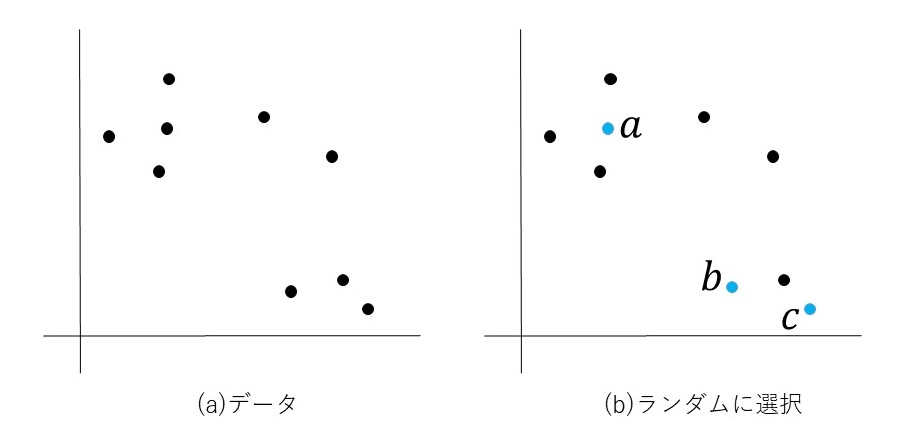


まず，Step 1 でデータ全体の中からランダムに3個のデータを選択し，それらをクラスター$C_1, C_2, C_3$とし，その位置を重心点とします．ここでは，図\ref{k-平均法１}(b) の$a$，$b$，$c$ が選択され，$a$，$b$，$c$ の位置が重心点となります．

Step 2 において，各データに対し，3個のクラスター $C_1, C_2, C_3$ の重心点の中で一番近いものを選ひます．その選択した重心点（クラスター）$C_i$を所属クラスターとします．図\ref{k-平均法２}(a) のように各データは $C_1, C_2, C_3$ に含まれます．


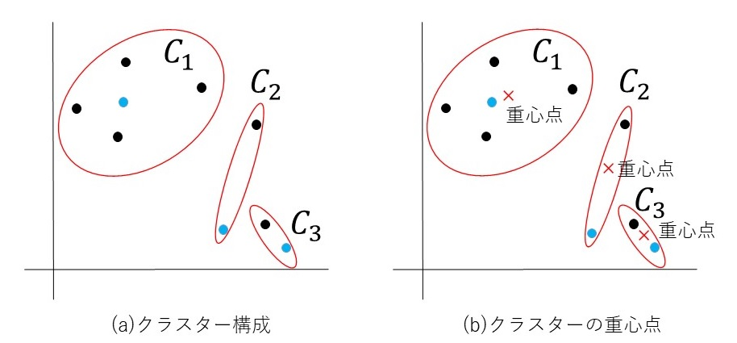


Step 3，4 において，それぞれのクラスター $C_1, C_2, C_3$ の重心を計算します．図\ref{k-平均法２}(b) のバツ印 × が新しいクラスターの重心となります．

Step 2 の繰り返しとなり，各データに対し，新たに求めた3個の重心点の中で一番近いものを選び，クラスターの再編を行います．図\ref{k-平均法３}(a) に示すように，データ$b$はクラスター$C_2$の重心点よりクラスター$C_3$の重心点の方が距離が近いので，データ$b$はクラスター$C_3$に統合され，クラスター$C_2$はひとつのデータに再構成されます．クラスター再構成後が図\ref{k-平均法３}(b) になります．


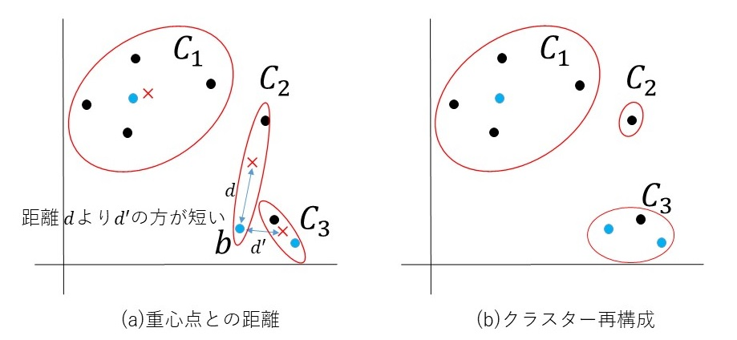


Step 3，4 において，新たに再編されたクラスター $C_1, C_2, C_3$ の重心を計算します．図\ref{k-平均法４}(a) がクラスター再構成後の重心点となります．また新しい重心点との距離を計算すると，図\ref{k-平均法４}(b) のようにデータ$x$は，クラスター$C_1$の重心より$C_2$の重心点のほうが距離が近いので，$C_1$から$C_2$への入れ替えでクラスター再構成が行われます．


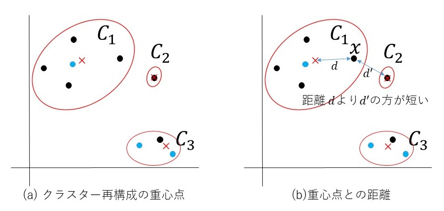


クラスター再構成後は，図\ref{k-平均法５}(a) のようになります．更に Step 2～4 を繰り返し，図\ref{k-平均法５}(b) のように新しいクラスターの重心点を求め，各データと重心点の距離を求めます．ただし，どのデータも更に距離が短くなる重心点は存在しないので，クラスターの更新が行われません．よって，これ以上再計算してもクラスター変更が行われないので終了し3つのクラスターに分割されます．

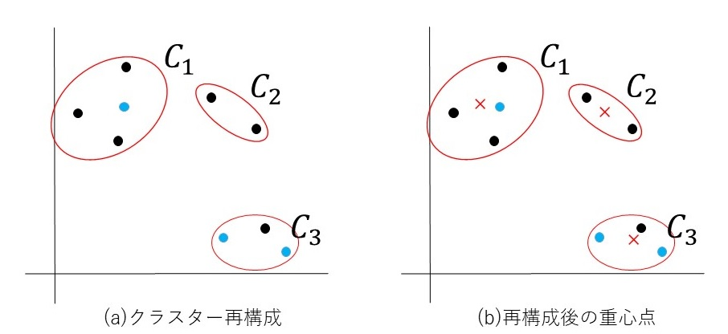


### $k$-平均法の欠点

k-means法のひとつの欠点として，初期値の設定により結果が大きく変わることがあります．初期値はランダムに設定されるので，初期値が近く集中してる場合など上手く分類ができない事例が発生します．同じデータを距離などを同じ条件にして計算しても，初期値が異なるだけで結果が大きく違うことがあります．従って，よいクラスターを得るためには，初期値を変えて何回か実行し，平均クラスター内距離が最小になる初期値を選択するなど，最適初期値での結果を採用することが望ましいです．


### R言語による非階層的クラスタリング

ここでは，R言語を用いて非階層的クラスタリングである $k$-平均法によるクラスタリングについて説明します．使用するデータは，階層的クラスタリングでも用いたクラスター分析用のデータ "ruspini" を使用します．まずはデータを確認します．R言語でのデータセットの名称は，"ruspini" であるので次のように入力すればデータの一覧が出力されます．

```
>library(cluster)　# ライブラリ取り込み
>ruspini　# データ表示
```


非階層的クラスタリング $k$-平均法で求めるには，kmeans関数を用います．関数 kmeans()には複数の引数設定がありますが，ここでは次の引数について説明します．

​                                 *kmeans(データフレーム名, k)*

第一引数に処理するデータフレーム名を入れます．第二引数$k$ にはクラスター数を指定します．初期値となる重心点は，データフレームからランダムに取り出されます．データ"ruspini"を4つのクラスターに分類するには次のように記述します．


```
>km <- kmeans(ruspini,4) # k-平均法実行
```


また，km$cluster に各データがどのクラスターに分類されたかを示すクラスター番号が格納されます．この値を利用して，散布図にクラスターごとに色分けを行い表示します．描画する関数plot() の引数calで色を指定できるので，クラスター番号をcal に設定することにより色分けできます．cal に設定する番号は 1から順に黒，赤，緑，青と色が割り当てられます．

```
>km$cluster # 実行結果のクラスター番号の確認
>plot(ruspini, pch=20, asp=1, col=km$cluster)　# クラスター番号をもとに散布図を色分けして描画
```

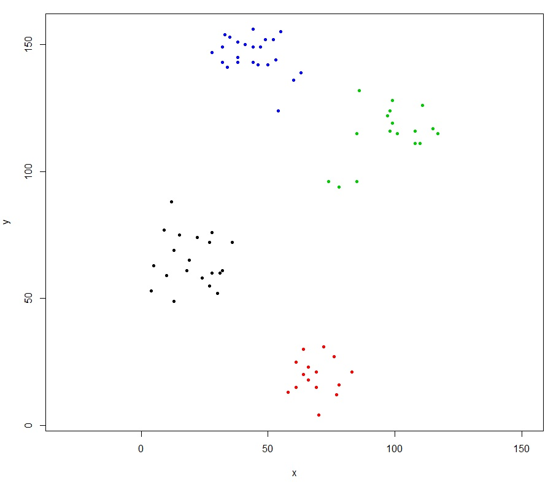


実行結果を図\ref{ruspini k-平均法}に示します．ただし，実行結果がこの図と同じ結果ではないかもしれません．なぜなら，前の「$k$-平均法の欠点」の節でも述べましたが，関数 kmeans()は，初期値となる代表点をデータフレームからランダムに取り出しています．よって，初期値により分類されるクラスターが変わる可能性があります．関数 kmeans()には，処理の繰り返し回数を変更できる引数 iter.max があり，以下のとおりiter.max = 1000 と設定すれば処理が1000回繰り返されます．なにも指定しなければ10回繰り返しとなります．処理を何度も繰り返すことにより，図\ref{ruspini k-平均法}と同じ平均クラスター内距離が最小となる結果になります．

```
>km <- kmeans(ruspini,4, iter.max = 1000)　# k-平均法を1000回実行
>plot(ruspini, pch=20, asp=1, col=km$cluster)　# クラスター番号をもとに散布図を色分けして描画
```


### Pythonによる非階層クラスタリング

Python による$k$-平均法でのクラスタリングについて説明します．使用するデータは，R言語同様にクラスター分析用のデータ "ruspini" を使用します．データ "ruspini" が記述されている csv ファイル ruspini.csv をまず読み込む必要があります．また，必要なライブラリを読み込んでおきます．csv ファイルを読み込むには関数pd.read_csv() を用います．csv ファイル ruspini の内容は，1行目にヘッダー（見出し行）が存在し，文字 x，y が入っています．また，インデックス（見出し列）として，1列目には連続する番号が存在します．関数pd.read_csv() では，引数になにも指定しなければ1行目をヘッダーとみなし，引数として index_col=0 とすることにより一列目をインデックスとして読み込みます．よって，以下の命令でファイルよりデータを読み込むことができます．

```
# ライブラリの読み込み
import numpy as np　
import pandas as pd 
from sklearn.cluster import KMeans 

# csvファイルからデータ読み込み
df = pd.read_csv('/users/username/documents/ruspini.csv', index_col=0)
```


ここでは，ヘッダーとインデックスは取り除いたデータのみ必要となりますので，次の命令でヘッダー，インデックスを取り除いたデータのみ2次元配列として変数 Data に格納します．その後，散布図を描画するため変数 Data の一列目を xの値，2列目を yの値として取り出しています．関数 plt.scatter() で第一引数にx軸の値，第二引数に y 軸の値，引数 cal に色を設定し，関数 plt.show() でデータ ruspini における散布図を描画します．

```
Data = df.values　#読み込んだデータのうち，ヘッダーとインデックスを取り除いた値を代入
x= Data[:,0]　# x軸の値を代入
y= Data[:,1]　# y軸の値を代入

plt.scatter(x,y,c="black")　# 散布図描画の設定
plt.show()　# 描画の実行
```


$k$-平均法でクラスタリングを行う関数 kmeans() において，クラスター数などの引数を設定します．クラスター数を引数 n_cluster のみ設定すれば実行することができます．ただし，この場合は先に説明した $k$-平均法より良い分類のクラスタリングとされる k-means++ というアルゴリズムで実行されます．普通の$k$-平均法と k-means++ では何が違うかと言うと，初期値の違いです．普通の$k$-平均法では重心となる初期値はランダムに選ばれますが，k-means++では初期値を決める際に，すべての重心点どうしが遠いところに配置されて偏らないようにしています．これにより，普通の$k$-平均法より良い結果を得られることが多いとされます．普通の$k$-平均法を実行したい場合には，引数 init ="random" と指定することにより実行できます．また，引数 n_init は，指定した回数だけ実行し，その中で一番より良い結果を出力することになります．引数が決まれば，関数 fit_predict() により実行し，変数 cluster に結果であるクラスター番号を格納しています．


```
kmeans_mod = KMeans(n_clusters=4) 　# k-平均法を実行
cluster = kmeans_mod.fit_predict(Data) #実行結果よりクラスター番号を取り出す
print( cluster ) # クラスター番号の確認
```


視覚的に分かりやすくするために，散布図において各データがどのクラスターに属するか色分けを行います．結果として得られた cluster に格納されているクラスター番号に基づき，例えば，クラスター番号が 0 の場合には赤色，1 の場合には青というように色を設定し描画しています．


```
#　クラスター番号をもとに散布図を色分けして描画
plt.scatter(Data[cluster==0,0],Data[cluster==0,1],color="r") 
plt.scatter(Data[cluster==1,0],Data[cluster==1,1],color="b") 
plt.scatter(Data[cluster==2,0],Data[cluster==2,1],color="g") 
plt.scatter(Data[cluster==3,0],Data[cluster==3,1],color="orange") 
plt.show()
```

